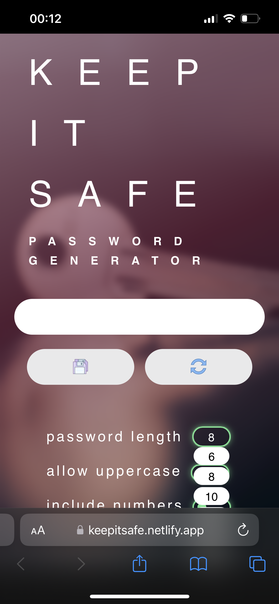

# Keep it safe

An easy to use password generator — no need to sign up and watch ads

<video width="480" controls>
  <source src="public/keepitsafe-demo.mp4" type="video/mp4">
</video>

## Demo

Here is a working live demo: https://keepitsafe.netlify.app/

## Mobile Support

The app is compatible with devices of all sizes and all OS's:
<p>
  
</p>

## Installation

Clone this repo to your desktop and run 

```bash
yarn install
```

to install all the dependencies.

## Usage

To start use the command below:

```bash
yarn start
```

You will then be able to access the app at localhost:3000

## Built With

<div>
  &nbsp;
  &nbsp;
  &nbsp;
  &nbsp;
  
</div>

## License

Distributed under the MIT License. See LICENSE.txt for more information.

## Contact

Feel free to contact me at [LinkedIn](https://www.linkedin.com/in/kriseldzarova/) or [Email](kris.eldzarova@gmail.com)
